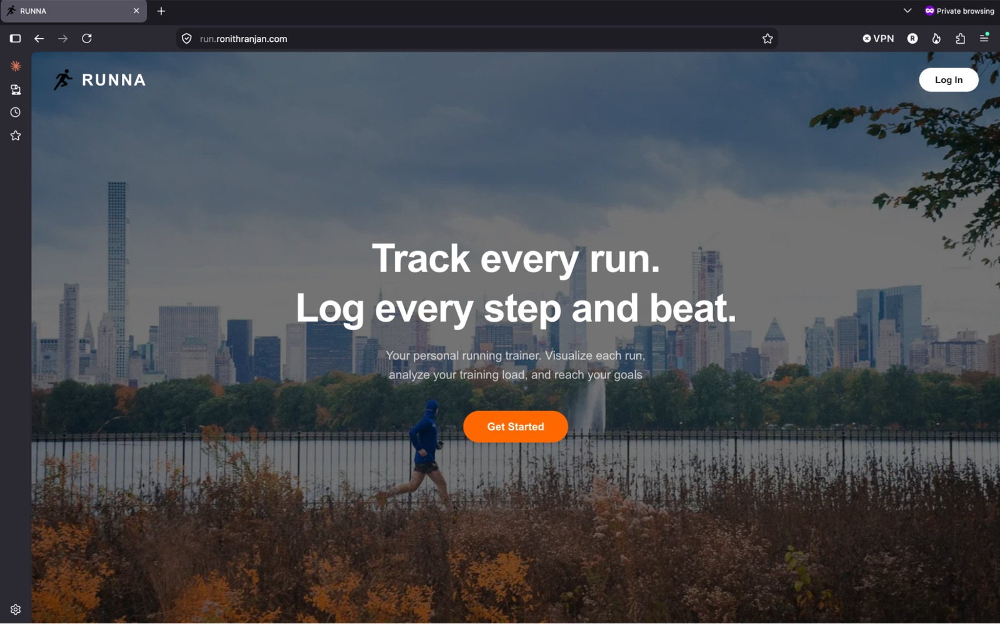
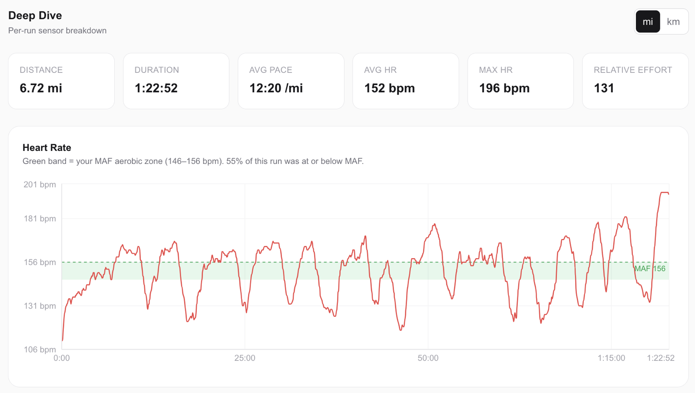
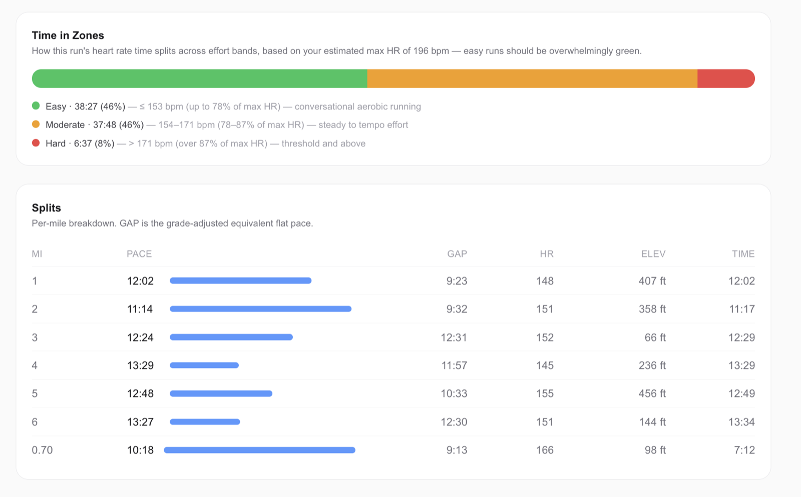
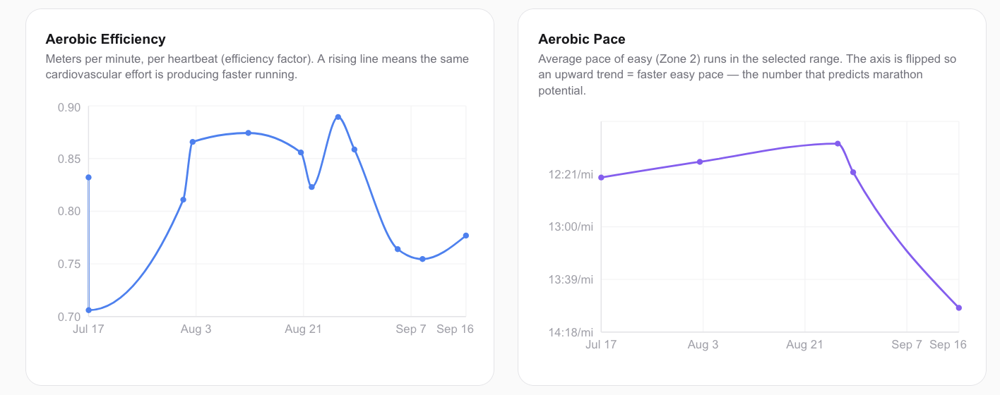
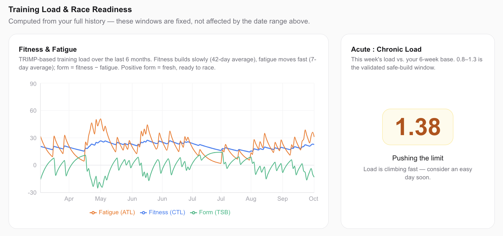
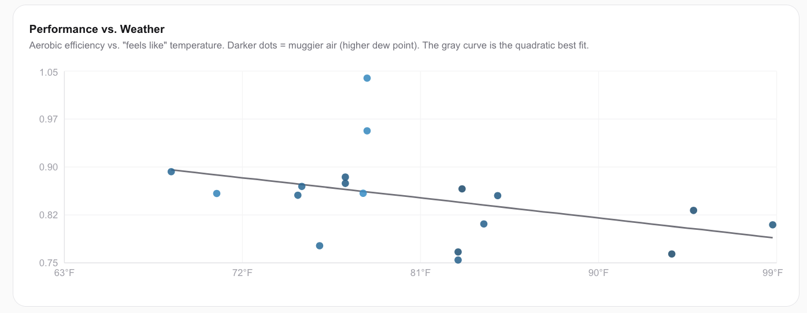

## Summary

- After years of excuses and on-and-off running, I set out to qualify for the Boston and NYC marathons as a test of whether I could commit to something nobody was paying me to do
- Strava kept me fixated on pace and on my friends' runs, so I used Claude Code to build my own app that tracks progress by heart rate instead
- The AI made the coding easy. The hard part was deciding what mattered
- Two months in, I've gone from running twice a month to three or four times a week, and I run a minute per mile faster at the same heart rate.

## The journey back to running

I was tired of my own excuses.

*I’ll never be as fast as I was before. Why bother?*

*I don’t have the time like I did in high school of dedicating two hours each day.*

*Even if I did, I won’t have the time when I start a full time job, so what use is it?*

I felt like every failed attempt at trying to get back into running left me frustrated and dejected. With the glory of my high school cross country days long behind me, I questioned the lack of discipline I had to stay consistent. I still found joy in the act of running. Running two or three times a month. But that was exercise, not real training. I knew that wouldn’t get me to where I wanted to go.

Why did this matter so much to me? I didn’t want to just run a marathon once. I wanted to qualify to run the *Boston Marathon* and *NYC Marathon.* But why?

My 3 AM nights. Most late nights in consulting I didn’t mind. When I was working with people I loved, clients I liked, on problems I found interesting, the hours felt worth it. But on the nights I was up alone, in a hotel somewhere far from friends, with my leftover Uber Eats stenching up the room, the project feeling unfulfilling, I questioned it all. On those nights, the question I asked myself was who was I without this job. What were the things I would choose to do if money wasn’t part of it.

Running was the answer I kept landing on. Running was *my time* and my time *alone*. I refused to run with ear buds or any music. Only my thoughts and worries bouncing in my head. And those too would dissipate midway through my run. I felt fulfilled after each run. Not just the happiness from the runner’s high right afterwards, but also from the pride that lasted the full day for having done something difficult. For committing and following through on something when nobody was paying attention.

*Boston* and *NYC* then became measuring sticks. Measuring sticks to test how far my resolve and commitment can go. All that was left in front of me was several years of training. Easy. I knew I was capable of it because I had shown that resolve before with eight seasons of cross country and track & field. I knew that in many ways, the starting few months are the toughest, but after that initial period, you have the momentum and establish a connection to your identity that makes it way easier to stick with the program.

## Identifying the sources of my excuses

I thought about all the excuses I have made in the past that prevented me from going on a run that day:

- Work is really busy today
- I stayed up late last night for work so its better to prioritize sleep than squeeze a run
- The weather is not great so I think it would be okay to skip today
- My running shoes have been feeling worn out recently; it’s better if I wait until I buy new ones
- Why bother running once a week if you aren’t going to see improvements without running more consistently throughout the week
- How dejecting to see how fast my running friends from the cross country days still are; I should just quit now
- My pace isn’t improving much, what progress can I even claim to have made?

Some of these excuses were more legitimate than others. A busy 60-80 hour week life in management consulting certainly wasn’t setting me up for success with my training. In the long term, I would have to figure out how to make that sustainable to support both work and my training goals or find another job.

Still, most of my excuses were pure lame. If your shoes are worn out, just go buy the same pair you love online instead of waiting to go in person and wasting weeks of not running. If it's raining outside, suck it up and put on a jacket. Individually, these excuses were minor yet collectively they used much of my mental energy in trying to overcome the resistance to lace up. I hated that the process didn’t feel automatic, and I wondered how I could alleviate some of the internal resistance.

Then came the idea of making my own running app. Up until that point, I relied on two apps. My Garmin app, which connected to my watch and uploaded data after a run. My Strava app, which made it easier to do analysis on my running. The problem was that Strava fueled some of my insecurities and increased my capacity to provide excuses.

There were three primary issues I had with Strava:

1. **Fueling social comparison** — Every time I opened Strava, the feed of my friends and followers was the first thing I saw. Someone biked 50 miles earlier today. Another person ran 6 miles at 6 min pace. Yet another person ran 12 miles at a 7 min pace, but with a 140 average BPM (beats per minute)
2. **Helpful features hidden behind premium** — Many of the advanced training analysis that Strava provided were hidden behind their premium plan. I didn’t want to pay for those features given how inconsistent of a runner I was. Some of those features would be really helpful like tracking relative effort, training loads, detailed heart rate analysis, and better comparison tools across past efforts
3. **Over emphasis on pace / speed** — The three major stats shown on any Strava running activity are distance, pace, and time. If you click into the run activity, you can see more stats like elevation gain, calories, and average heart rate. Still, the thing I would mentally anchor on the most was pace. When trying to rebuild my running base, pace was the wrong thing to focus on

## Restructuring the tool to support my goals

*Landing page of run.ronithranjan.com*

In designing my new running app, the goal was to create an easy-to-update tool that I could return to after each run and concretely see how my progress stacked up against my goals. Before I could move forward, I needed to clearly define what “progress” meant for me.

To me, the answer was clear: [low heart-rate training](https://www.runandbecome.com/running-training-advice/low-heart-rate-training). Despite how fast I had become in high school, I knew that my old performance would not be sustainable in the long term. Even on easy runs, my heart rate would spike up significantly above what it should be (e.g., 180+ bpm on 10 min/mile pace). A more sustainable plan would have to address that directly.

*The first chart I look at after ever run*

Towards that end, I wanted to measure success by the percentage of time I spent below what I considered my training threshold. I also wanted to see how the efficiency of my run improved over time. Equally important, I wanted a metric that enabled me to track the toll of my recent runs so that I didn’t risk overtraining or exerting myself. I added new metrics to center my attention around (e.g., heart rate graph with target bar line, time spent in zones, categorizing and tracking runs by time spent in zones, efficiency of runs measured by meters per min per bpm, load management metric).

*Time spent in different heart rate zones and splits*

*Charts tracking how my run efficiency (speed divided by bpm) changes over time. Clearly not all improvements*

After each run, I would measure success by how effectively I kept my heart rate below the pre-established threshold. I was starting to measure my success in a way that benefits me more. Rather than getting stuck on my friend's speed, I could focus on my own ability to stick below a target heart rate threshold. I now could increase my training load while limiting the risk of an injury from ramping up too quickly.

Each week, I found myself adding new improvements. For example, after talking to a friend about the effects of weather on running, I realized I could leverage weather data to inform my training. Weather plays a significant role in the quality of your run (e.g., heat, humidity, precipitation). I wanted to control for that variable so that when I compared my runs I properly accounted for when the weather made it more difficult. With a weather API, I was able to automatically pull in the relevant data for all my runs and create a baseline comparison to see how my performance for a given day of weather compared to similar other days.

Building the app felt a lot like getting back into running. I was scared at first given how much software engineering has changed in the two years that I graduated with a computer science degree. But the hard part wasn’t doing the work. AI had solved that. It was instead doing the thinking and deciding on what mattered.

## Lessons from vibecoding

Using Claude Code in VSCode and the Fable model, I was able to build this app over the course of a week within ~8 hours. I learned a few things through the process.

### 1. The need for clear vision

AI models are a powerful tool. But they are a tool that will punish you or reward you based on the clarity of vision you have. Early on, I tried to outsource many of the decisions to Claude. Even though I had an initial perspective on the things that mattered (e.g., making low heart training my core progress meter), I tried to get Claude to look up best practices and form a decision on everything from scratch, all at once.

My process was exhausting. Bringing every decision into question and diving into a separate thread exploring the minutiae of every decision drained my energy and time. Most times my perspectives were already in line with best practices. Even though Claude could provide endless analysis and paragraphs on any question I asked, many of my initial questions didn’t need such a digression. Once I started to reassert control by directing it to build around my principles and worldview, the creation process became much more manageable.

I became willing to supply a greater number of details in each of my prompts. This in turn made it easier for the agent to come up with something resembling what I had in mind and also easier to evaluate the output against my original vision.

In the past, I struggled to adopt Lovable and v0 because those tools tend to incentivize the user to drift away from the role of being the “driver” of the creation process. I’m not sure that the UI is conducive or encouraging to a more systematic approach where you can stay close to the product being built. At some point, the temptation becomes strong to keep starting over and hoping that the next probabilistic generation is closer to what you had in mind than to iterate.

I intentionally chose a development approach that forced me to stay closer to the app. I wanted to make sure I maintained an understanding of the major elements of the process unfolding and that I took the time to define the product direction upfront.

There are two files I spent 1-2 hours defining upfront:

- FEATURES.md — I asked Claude to collect all the features it could find online from existing run analysis apps (e.g., Strava, Garmin) through the lens of a marathon coach. I also asked it to come up with features or ideas for the things that may not exist on the apps it finds online but that it thinks could be helpful for someone who has historically struggled to stay consistent with their training and gets dissuaded when he feels like he isn’t making progress
- PRODUCT.md — This is where I took a more directed approach in telling Claude what was important to me. I had a perspective on the tech stack I wanted (i.e., Next.js framework, PostgreSQL + Prisma hosted on Supabase, simple credentials with NextAuth.js, MapBox for route maps / heat maps, deployed on Vercel). I established the core features necessary for the MVP and gave it some design principles. Then I gave it my opinion on the order in which it should build things and how it could organize the sprints to have checkpoints for me to validate its work.

I now had a list of features to act as my backlog and future inspiration as well as a clear, cohesive vision for how the app would be developed.

### 2. Exercising judgment and making tradeoffs explicit

I found that there were times when I would be planning a sprint execution with Claude and that a feature I once considered essential could be further simplified. For example, in an early sprint, I wanted a way to pull in my running data so that I could see the latest analysis. I didn’t want to have to manually upload GPX / FIT data after each run. I tried connecting it directly to my Garmin and Strava account. The Garmin API documentation was weak, and it wasn’t immediately clear how quickly I could integrate it with my app. Strava wouldn’t allow you to use their API without paying for the premium account, which would take out some of the excitement of building this app.

Undeterred, I decided to spend some time looking at other running websites / apps that might offer a quick integration, I discovered intervals.icu. Intervals is an advanced running website that endurance athletes and data-driven coaches use to track training. It already has several connections built into their website as well as offers an easy to use API. I quickly made an account on their website, connected it to my Garmin app, and then used their API to pull in the relevant data to my website.

At the time, I initially resisted the idea of adding in an intermediary step just to make the connection. When I thought deeper about why my mind was resisting it, I realized that I had an underlying desire to create a website that could easily be made available to others so that they too could connect their running data and use it. By identifying this previously unstated desire, I realized that I had a tradeoff to make. I could put in the extra effort of creating a tool that others could use or stick to a focus on what would be important to me for my training.

I decided that focusing on my own training was the priority over developing an application that most likely no one else would ever use. Applying that judgment early on enabled me to make a tradeoff that saved likely 10-20% additional effort that wouldn’t have improved my own training analysis. It enabled me to focus on what truly mattered. The danger with powerful AI tools is that we may overcomplicate solutions. With the time saved from not having to code, we may create more complex or “complete” applications that add marginal value. It would have been a mistake to do so.

### 3. Illusions of strengthening my technical skills

I had initially hoped to strengthen my technical skills through building parts of this website. I thought there could be pieces of the application that I could develop myself rather than delegating to Claude. Having not done any significant programming in the past two years, the intent was to see how much I still remembered and rebuild those skills. I quickly realized how foolish it would have been to try to do so. The speed at which agentic AI can create decent code far outmatches what I could do on my own. I would have been better off “practicing” with LeetCode than making contrived exercises for myself within the application.

With those illusions dissipated, I thought about how I could continue "practicing" by reviewing the code that was being generated in addition to testing the actual functionalities. Even if I wouldn’t be coding the app myself, reviewing the code manually would mean I stayed closer to the product being built and could theoretically build features manually in the future. This too proved to be a false ideal. My attempts didn’t even last the first sprint.

I did open every folder and file Claude created. But reading turned into skimming and skimming turned into scrolling. My understanding of the codebase was barely any better than my understanding had I just relied on the high level folder structures to explain how it all worked together. Fable 5.1 was just too good and my ability to maintain attention to detail file by file could not keep up.

None of those lessons matter if the app isn't getting me to lace up.

## Did it work?

Not all of the excuses have disappeared. In the mornings, when I’m cozied under the blanket, I still hear *I’ll never be as fast as I was before; why not stay in this morning?* I still feel the urge to skip a day when I tell myself *I’m delusional for thinking about getting a BQ time when I’ve barely started.* The difference is now I have a chart I can go to that gives me a reminder of all that I’ve worked to. A chart that shows me that I spent 90% of my last run below my target heart rate threshold. That my pace at 150 bpm is 1 minute faster per mile than it was 2 months ago. Another chart showing that I went from running 2 times a month to 3-4 times a week.

For the first time in years I can clearly see where I truly am and run my own race.

---

P.S. If anyone thinks that having access to this running app would be helpful for their own goals, please reach out. I would love to invest the time in building it out more for someone else to use. Would also love to hear about other people’s own journey with running and what they have found helpful.
